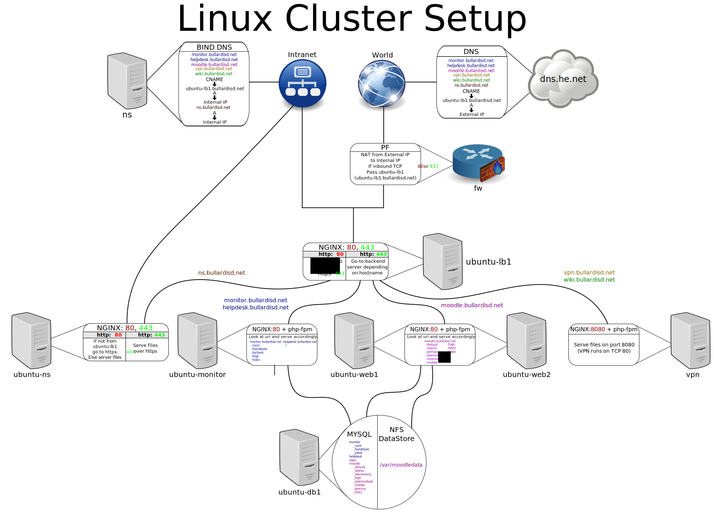

Web Cluster Howto
=================

Web services have been abstracted out to their separate components. This way they can be split among different servers.

In reality, this just means that we run our :doc:`Web <web>` servers on different servers than :doc:`MySQL <db>` runs on. We also throw in a :doc:`Load Balancer <lb>` to allow multiple :doc:`Web <web>` servers to run the same service, and to take on the HTTPS strain.

Cluster Components
^^^^^^^^^^^^^^^^^^

.. toctree::
    :maxdepth: 1

    server.rst
    db.rst
    db_manage.rst
    data.rst
    web.rst
    web2py.rst
    lb.rst

Software Setup
^^^^^^^^^^^^^^

.. toctree::
    :maxdepth: 1

    inventory.rst
    moodle.rst

Monitoring Software Setup
^^^^^^^^^^^^^^^^^^^^^^^^^

* :doc:`../monitor/cacti`

* :doc:`../monitor/ipcheck`

* :doc:`../monitor/piwik`

Other Software Setup
^^^^^^^^^^^^^^^^^^^^

* :doc:`../helpdesk/rt`

Choosing a Server
^^^^^^^^^^^^^^^^^

In general, services can be separated or combined on servers freely. However it is more efficient (at least) to separate the :doc:`Load Balancer <lb>` , the :doc:`Web Servers <web>` , and the :doc:`Database <db>` onto separate servers. We combine the :doc:`Database <db>` and the :doc:`Data <data>` services onto the same server. We also run the :doc:`Database Management <db_manage>` service on the same server.

For most applications, you will want to choose the highest-spec server for the :doc:`Database <db>` service. This service is the hardest to scale. The :doc:`Web <web>` servers scale very easily, so you can pick lesser-spec servers. (Though if you are using :doc:`Moodle <moodle>` you will need fairly decent :doc:`Web <web>` servers.) The :doc:`Load Balancer <lb>` service is fairly lightweight, so you can choose a low-spec server to run this service.

See :doc:`../servers/index` for the specs of our servers.

Diagram
^^^^^^^

`Click here for full image <cluster.svg>`_

In the above diagram :doc:`ns <../servers/ns>` is our internal DNS server, and dns.he.net is our external DNS server.
